## COLOR K-MEANS CLUSTERING

This module takes a stream of camera data in pixel pipeline format. This stream must be presented to the inputs iRgb.red, iRgb.red, iRgb.red, iRgb.valid, iRgb.eol, iRgb.eof and iRgb.sof. The result of this module steam K-Mean rgb cluster color space in output oRgb channel.

The implemented image segment uses K-Mean clustering algorithm for FPGA Devices, and it has been designed with a standard Xilinx AXI4 streaming interface, so that it can be inserted as module ip within any image processing pipeline.

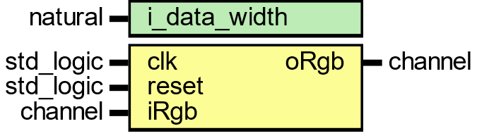

This module is synthesized and implemented using Vivado 2022.1 for KRIA KV260 board and verified using ModelSim 2020 edition simulator.

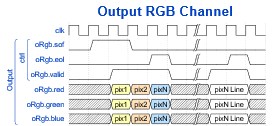

In this section, K mean-based color quantization algorithm is applied to rgb frame.

- Select rgb k color references for k points to decide number of clusters.
- Find the distance of each input pixels with selected rgb k points. 
- Assign each new pixel value to closest selected rgb n values using Euclidean distance.
- Pixels which are nearest to the selected rgb values allocated to a cluster.

Euclidean distance is calculated between original image pixel Red1, Green1 and Blue1 and reference pixel color schemes.

Rgb Image of video frame consist of 0 to 255 values per rgb channel which gives 256x256x256 colors, and the goal is to use color k mean cluster to set number of clusters. Minimum distance is the final candidate for being closest to the source rgb color. If an RGB image color depth of 24 bits which is 16 million of colors, after K-mean clustering with value n, then image is converted to a version of n colors.

K-mean cluster module convert 16 million of rgb colors into n color version. The module has clock and reset ports. Port iRGB and oRGB consist of red, green, and blue rgb channels with valid signal.

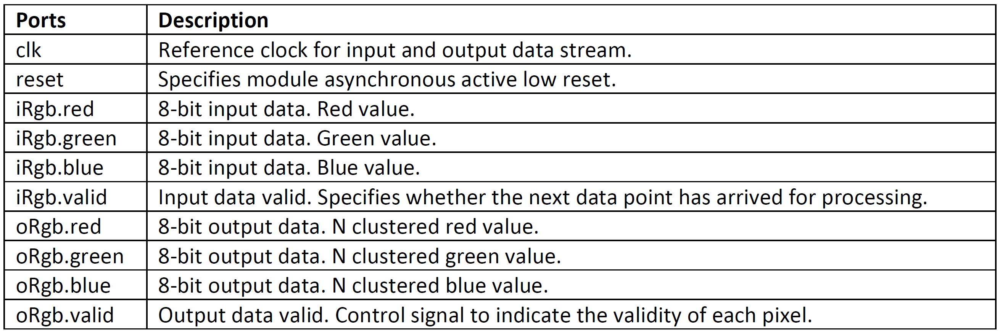

The Functional block diagram of the implemented rgb to n clustered conversion is shown in Figure below. 

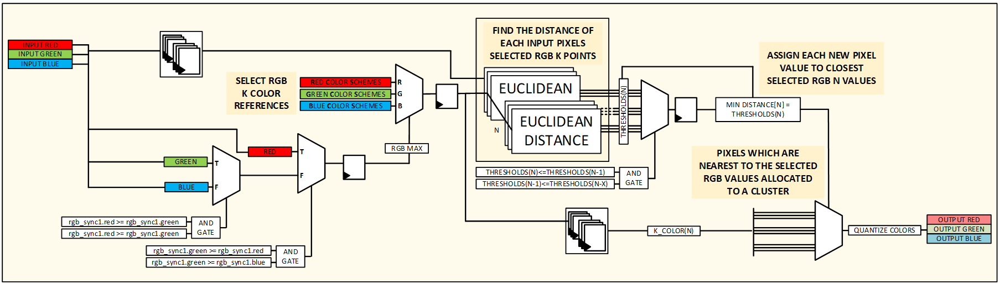

The codebook created for K-Means is called the color palette or reference color scheme.

### K EQUALTO 6 REFERENCE COLOR SCHEMES

Generated image below is the result of k-mean clustering using 6 colors references of palette schemes.

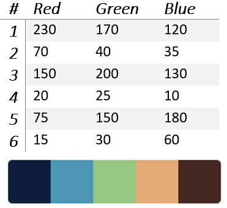

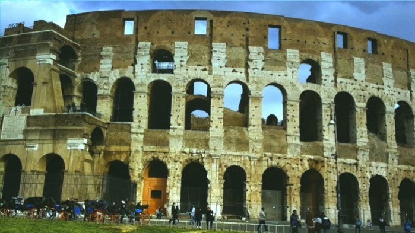
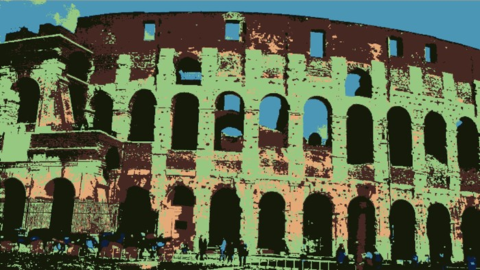

### K EQUALTO 9 REFERENCE COLOR SCHEMES

In this reference, k parameter set to k = 9, where k is the number of clusters. K-mean color quantization quantizes input image to number of colors into 9 clusters from 9 refences of color schemes. 

### K EQUALTO 24 REFERENCE COLOR SCHEMES

In this reference, k parameter set to k = 24, where k is the number of clusters. K-mean color quantization quantizes input image to number of colors into 24 clusters from 24 refences of color schemes. 

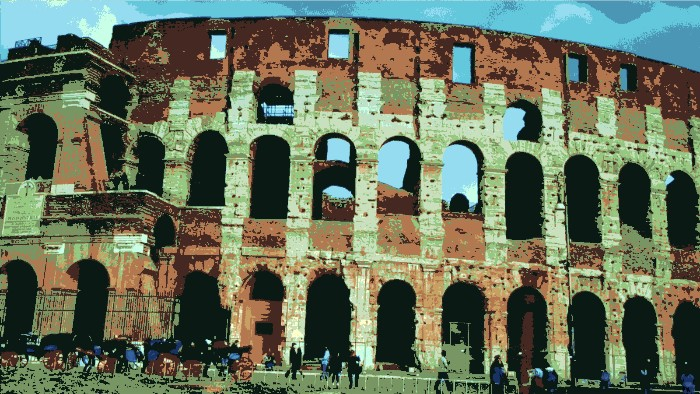

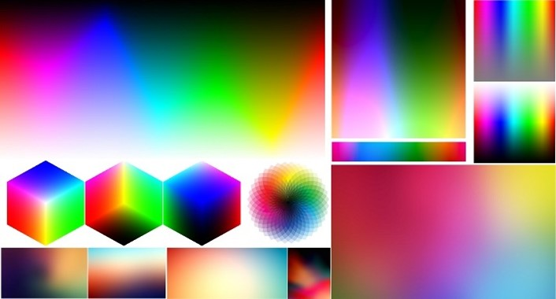
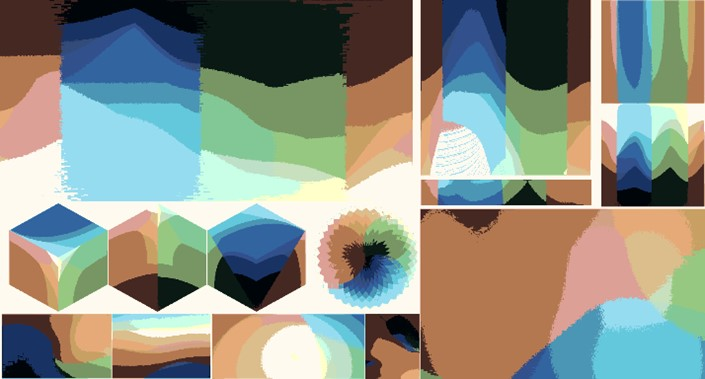

### K EQUALTO 51 REFERENCE COLOR SCHEMES

In this reference, k parameter set to k = 51, where k is the number of clusters. K-mean color quantization quantizes input image to number of colors into 51 clusters from 51 refences of color schemes. 

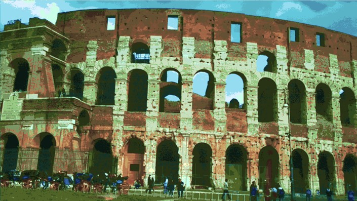

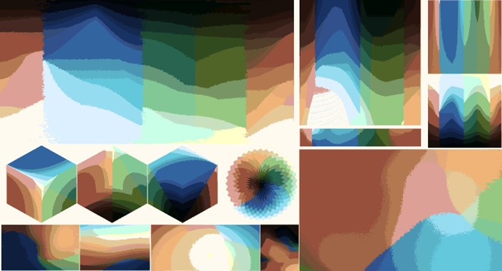

